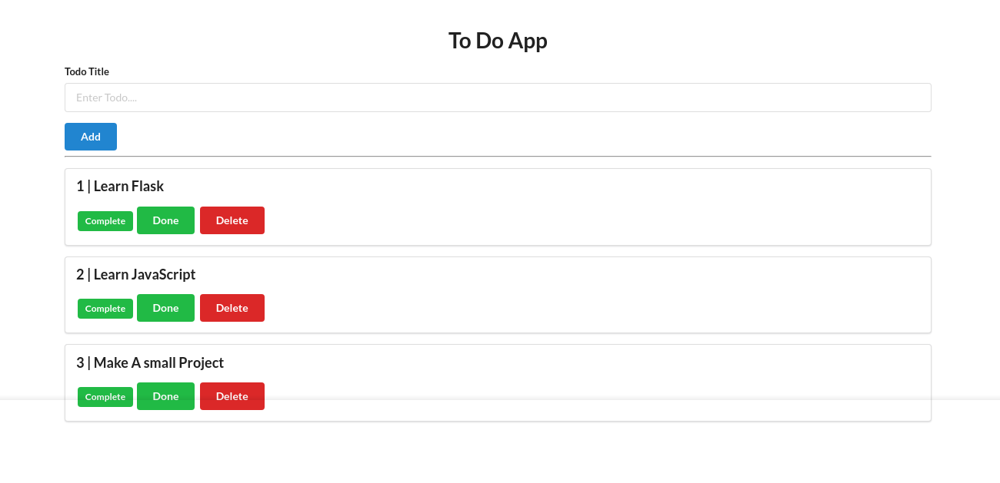

# My First Flask Todo app 
## Description:
This is a simple Todo web application built using Flask, Semantic UI, and HTML. The app allows users to create, update, and delete tasks in a todo list.

## Stack:
- Flask Microframework
- Semantic UI
- HTML 
- Render (Free Cloud Platform to Deploy App services ) 

>  utilized various stacks in separate branches to deploy the same app, aiming to learn from diverse stacks simultaneously and expand my understanding across multiple technologies : 

- Used Render in this branch to deploy the app.
- Employed Vagrant in the second branch to revisit and reinforce Vagrant skills.
- Utilized Ansible, Vagrant, and PostgreSQL in the third branch, marking my first experience with Ansible.


## Project Setup:
1. Clone The Repository : 
Clone the repository using the command:
```bash
git clone https://github.com/Twarga/Project1A
```
2. Install Dependencies : 
Navigate to the project directory and install the required dependencies from the requirements.txt file

```bash
pip install -r requirements.txt

```

3. Running The application Locally :
Execute the following command to run the Flask development server:
```bash
python app.py
```
***Access the app at http://127.0.0.1:5000/ in your browser.***


# Happy Coding